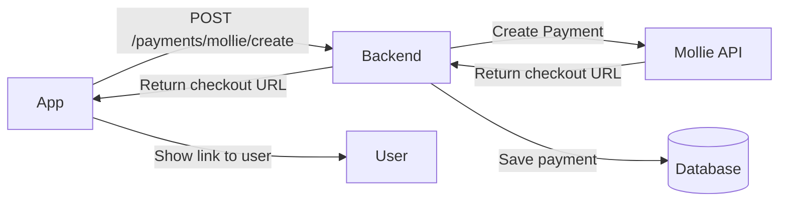
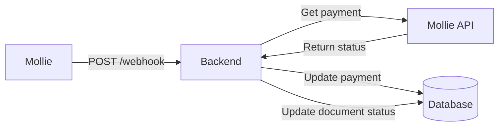

# Mollie Payments Integration

Complete Mollie payments setup voor Offerto.

## 🚀 Setup

### 1. Mollie Account Aanmaken

1. Ga naar [Mollie.com](https://www.mollie.com/nl)
2. Klik op "Aanmelden" (gratis, geen kosten)
3. Vul bedrijfsgegevens in
4. Verifieer email

### 2. API Key Ophalen

1. Log in op [Mollie Dashboard](https://www.mollie.com/dashboard/)
2. Ga naar **Developers** → **API keys**
3. Kopieer de **Test API key** (begint met `test_`)
4. Voor productie: gebruik **Live API key** (na verificatie)

### 3. Backend Configuratie

Voeg toe aan `backend/.env`:

```env
MOLLIE_API_KEY=test_xxxxxxxxxxxxxxxxxxxxxxxxxxxxxx
API_URL=http://localhost:4000
FRONTEND_URL=http://localhost:8081
```

**Voor productie:**
```env
MOLLIE_API_KEY=live_xxxxxxxxxxxxxxxxxxxxxxxxxxxxxx
API_URL=https://api.offerto.nl
FRONTEND_URL=https://app.offerto.nl
```

### 4. Database Migratie

```bash
cd backend
node migrate-mollie.js
```

Dit creëert:
- `payments` table
- `payment_events` table (audit trail)
- `payment_status` kolom in `documents`

### 5. Webhook Configuratie

#### Development (lokaal testen)

1. Installeer [ngrok](https://ngrok.com/):
   ```bash
   npm install -g ngrok
   ```

2. Start ngrok tunnel:
   ```bash
   ngrok http 4000
   ```

3. Kopieer de HTTPS URL (bijv. `https://abc123.ngrok.io`)

4. Update `backend/.env`:
   ```env
   API_URL=https://abc123.ngrok.io
   ```

5. Configureer in [Mollie Dashboard](https://www.mollie.com/dashboard/developers/webhooks):
   - Webhook URL: `https://abc123.ngrok.io/payments/webhook`

#### Production

1. Configureer webhook in Mollie Dashboard:
   - Webhook URL: `https://api.offerto.nl/payments/webhook`
   - ✅ Aanvinken: Payment status changes

---

## 📖 API Endpoints

### Create Payment Link

```http
POST /payments/mollie/create
Authorization: Bearer <jwt_token>
Content-Type: application/json

{
  "documentId": "123e4567-e89b-12d3-a456-426614174000"
}
```

**Response:**
```json
{
  "success": true,
  "paymentId": "pay_abc123",
  "molliePaymentId": "tr_WDqYK6vllg",
  "checkoutUrl": "https://www.mollie.com/checkout/...",
  "status": "open",
  "amount": 123.45,
  "existing": false
}
```

### Webhook (Mollie calls this)

```http
POST /payments/webhook
Content-Type: application/json

{
  "id": "tr_WDqYK6vllg"
}
```

**Response:**
```json
{
  "received": true,
  "success": true,
  "paymentId": "pay_abc123",
  "oldStatus": "open",
  "newStatus": "paid"
}
```

### Get Payment Status

```http
GET /payments/:paymentId/status
Authorization: Bearer <jwt_token>
```

**Response:**
```json
{
  "success": true,
  "payment": {
    "id": "pay_abc123",
    "documentId": "doc_123",
    "documentNumber": "F-2025-001",
    "molliePaymentId": "tr_WDqYK6vllg",
    "checkoutUrl": "https://www.mollie.com/checkout/...",
    "amount": 123.45,
    "currency": "EUR",
    "status": "paid",
    "paidAt": "2025-12-08T10:30:00Z"
  }
}
```

### Get Document Payments

```http
GET /payments/document/:documentId
Authorization: Bearer <jwt_token>
```

---

## 🔄 Payment Flow

### 1. Gebruiker maakt betaallink



### 2. Klant betaalt

```
User → Opens checkout URL → Mollie Payment Page
    → Pays with iDEAL/Card/etc
    → Redirected to success page
```

### 3. Webhook updates status



---

## 💳 Mollie Payment Methods

Ondersteund (automatisch beschikbaar):
- **iDEAL** (Nederland)
- **Bancontact** (België)
- **Credit Card** (Visa, Mastercard)
- **PayPal**
- **SOFORT** (Europa)
- **Apple Pay**
- **Google Pay**
- **Bank transfer**
- **Klarna** (Pay later)

Geen extra code nodig - Mollie regelt dit automatisch!

---

## 🧪 Testing

### Test Credentials

Mollie test mode ondersteunt alle payment methods.

**Test cards:**
- Success: `5555 5555 5555 4444`
- Failed: `5555 5555 5555 5557`

**Test iDEAL:**
- Kies "ABN AMRO" → Success
- Kies "Rabobank" → Pending
- Kies "ING" → Failed

**Test with cURL:**

```bash
# Create payment
curl -X POST http://localhost:4000/payments/mollie/create \
  -H "Authorization: Bearer YOUR_JWT_TOKEN" \
  -H "Content-Type: application/json" \
  -d '{"documentId": "YOUR_DOCUMENT_ID"}'

# Simulate webhook (replace tr_xxx with real payment ID)
curl -X POST http://localhost:4000/payments/webhook \
  -H "Content-Type: application/json" \
  -d '{"id": "tr_WDqYK6vllg"}'
```

---

## 💰 Pricing

**Mollie kosten:**
- €0.29 per transactie
- iDEAL: geen extra kosten
- Credit card: +1.8%
- Bancontact: geen extra kosten
- PayPal: +3.4%

**Geen maandelijkse fees!**

[Volledige pricing](https://www.mollie.com/nl/pricing)

---

## 🔐 Security

### Webhook Security

Mollie webhooks zijn **NIET** signed. Best practices:

1. ✅ **Verify payment via API**: We fetchen altijd de payment via Mollie API (niet vertrouwen op webhook body)
2. ✅ **Use HTTPS**: Webhook URL moet HTTPS zijn (productie)
3. ✅ **Rate limiting**: Prevent spam (express-rate-limit)

### API Key Security

- ❌ **NEVER** commit API keys to git
- ✅ Use `.env` file (gitignored)
- ✅ Different keys voor test/live
- ✅ Rotate keys periodically

---

## 📊 Payment States

| Status | Betekenis | Actie |
|--------|-----------|-------|
| `open` | Payment link created | Wacht op betaling |
| `pending` | Processing | Wacht op bevestiging |
| `paid` | ✅ Betaald | Update document status |
| `expired` | Link verlopen | Nieuwe link maken |
| `failed` | Mislukt | Retry mogelijk |
| `canceled` | Geannuleerd | Nieuwe link maken |

---

## 🐛 Troubleshooting

### "Mollie API key not configured"
- Check `.env` file bevat `MOLLIE_API_KEY`
- Restart backend server

### "Payment not found in database"
- Check database migratie gedraaid: `node migrate-mollie.js`
- Check payment was gecreëerd via API

### Webhook not firing
- Check ngrok running (development)
- Check webhook URL correct in Mollie dashboard
- Check firewall allows incoming requests
- Check logs: `tail -f backend.log`

### Payment succeeds but document not updated
- Check webhook URL correct
- Check backend logs voor errors
- Manually call webhook: `POST /payments/webhook`

---

## 📚 Resources

- [Mollie API Docs](https://docs.mollie.com/)
- [Mollie Dashboard](https://www.mollie.com/dashboard/)
- [Node.js Client Docs](https://github.com/mollie/mollie-api-node)
- [Webhook Guide](https://docs.mollie.com/overview/webhooks)

---

## ✅ Checklist

**Development:**
- [ ] Mollie account aangemaakt
- [ ] Test API key in `.env`
- [ ] Database migratie gedraaid
- [ ] ngrok installed & running
- [ ] Webhook configured in Mollie dashboard
- [ ] Test payment succesvol

**Production:**
- [ ] Mollie account geverifieerd
- [ ] Live API key in productie `.env`
- [ ] Productie webhook URL in Mollie dashboard
- [ ] HTTPS enabled
- [ ] Error monitoring (Sentry)
- [ ] Rate limiting enabled
- [ ] Backup strategie

---

**Mollie integratie compleet!** 🎉

Test met een factuur, klik "Betaallink maken", en betaal via Mollie test mode.
